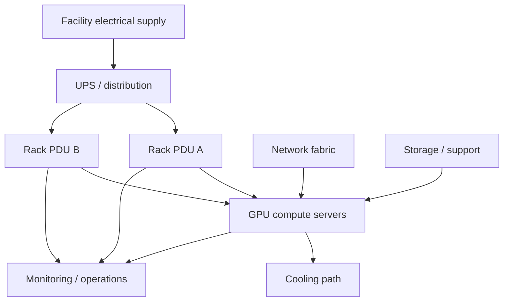

# Atlas-Rack

> **Operation Atlas — design an AI rack that looks great on a diagram, then keep redesigning it until power, cooling, cabling, serviceability, and failure reality all agree.**

## Skills you will build

- Rack units, server density, and physical layout
- AI server / GPU platform form factors
- Power-chain reasoning from facility feed to server
- kW, amperage, redundancy, and three-phase concepts
- Rack PDU placement and capacity planning
- Air cooling vs liquid-cooling architecture
- CDU, manifold, and heat-removal concepts
- Network/cable-path planning
- Weight, serviceability, maintenance clearances, and failure domains
- BOM creation, design tradeoffs, and architecture-review communication

## General idea

Atlas-Rack is the **physical AI-infrastructure design lab**.

A fictional company called **Northstar Compute** has signed a customer whose workload requires a dense new GPU deployment. Sales has already promised the capacity. Hardware has been shortlisted. The data-center team has one available rack position.

Then the constraints arrive.

Power is limited. Cooling is limited. The rack has finite space. Redundancy consumes capacity. Cables need somewhere to go. Components need to be replaceable without dismantling half the rack. Some “perfect” server combinations turn out to be impossible once facility limits are considered.

You are the infrastructure engineer responsible for **Operation Atlas**.

Your job is not to create the prettiest rack elevation.

Your job is to answer:

> **Could this rack actually be installed, powered, cooled, cabled, maintained, and recovered when something fails?**

This is primarily a design and modeling lab, so it is fully possible on a laptop. Use public vendor specifications and clearly cite/model the hardware instead of implying you physically deployed equipment you did not.

---

# The assignment

Northstar's first requirement sounds easy:

> “Fit the maximum useful AI compute into one rack.”

Then Facilities adds:

- a rack power ceiling,
- redundant feeds,
- cooling restrictions,
- a weight limit,
- service-access requirements,
- and a requirement that one failed power path cannot drop the entire rack.

Networking wants redundant top-of-rack connectivity.

Operations wants equipment arranged so technicians can actually replace it.

Finance wants the least expensive design.

Your first drawing will almost certainly be wrong.

That is the point.

---

## Design campaign

| Review | New constraint | Skill focus | Deliverable |
|---|---|---|---|
| 00 | **The Empty Rack** | U-space, dimensions, inventory | first rack elevation |
| 01 | **The Power Bill Arrives** | watts, amps, feed capacity | power budget |
| 02 | **A Feed Dies** | A/B power, redundancy | resilient power map |
| 03 | **Too Hot to Ship** | heat load, airflow | cooling calculation + redesign |
| 04 | **The Liquid Option** | CDU/manifold concepts | air vs liquid comparison |
| 05 | **Cable Jungle** | fiber/copper/power paths | cable and port map |
| 06 | **The Technician Revolts** | serviceability | maintenance-friendly revision |
| 07 | **The Floor Has Opinions** | weight/loading concepts | physical-risk review |
| 08 | **One More GPU Server** | density vs margin | defend capacity headroom |
| 09 | **Budget Cut** | BOM and tradeoffs | cost-aware redesign |
| 10 | **Failure Friday** | component/fabric/feed failure | failure-domain analysis |
| FINAL | **Architecture Review Board** | full design defense | present Atlas vFinal with assumptions and risks |

---

## The rack as a system



Atlas-Rack should make you think about **interacting constraints**, not independent components.

---

## The Atlas constraint board

Every revision should track at least:

```text
Rack U used / available
IT power demand
A-feed demand
B-feed demand
redundancy margin
estimated heat load
cooling method
network ports
cable count / media
weight estimate
serviceability concerns
single points of failure
cost estimate
assumptions
```

When one change improves a metric, ask what it makes worse.

Example:

```text
Add another GPU server
        ↓
more compute
        ↓
more power + heat + weight + ports + cables
        ↓
less redundancy/headroom
        ↓
possible cooling redesign
```

---

## Surprise constraint cards

To make the lab more than a static drawing, introduce constraints after each design revision.

Examples:

### Card: No More Power
The facility will not approve another circuit. Recover capacity without violating redundancy policy.

### Card: Rear-Door Problem
Your proposed cable layout blocks service access to a frequently replaced component.

### Card: Cooling Ceiling
The rack's heat load exceeds the allowed air-cooled density. Decide whether to reduce compute density or introduce a liquid-cooling design.

### Card: Failed PDU
One rack PDU is unavailable. Determine which equipment stays up and whether the surviving path is overloaded.

### Card: Finance Says No
Reduce capital cost by 20% and explain the performance/resilience tradeoff.

### Card: Growth Arrives Early
Northstar needs 25% more compute six months later. Explain what your original design did—or did not—leave room for.

---

## Design artifacts

Useful outputs include:

- rack elevations
- power-chain diagrams
- cooling-chain diagrams
- BOMs
- cable/port maps
- failure-domain maps
- power and thermal calculations
- design assumptions
- versioned architecture revisions
- architecture decision records
- a final design-review deck or document

The project should retain earlier bad designs. Showing **why Atlas v1 failed and how Atlas v4 improved it** is stronger evidence than publishing only the polished final picture.

---

## Suggested repository structure

```text
Atlas-Rack/
├── README.md
├── requirements/
├── designs/
│   ├── v1/
│   ├── v2/
│   └── final/
├── power/
├── cooling/
├── network/
├── bom/
├── failure-analysis/
├── decisions/
└── evidence/
```

---

## Completion standard

Atlas-Rack is complete when you can defend a hypothetical AI rack in front of people representing:

- data-center facilities,
- network engineering,
- systems/GPU engineering,
- operations,
- finance,
- and reliability.

You should be able to explain not only **what is in the rack**, but:

- why it fits,
- why it can be powered,
- how its heat is removed,
- how it is cabled,
- what fails when components go down,
- what can be serviced safely,
- what headroom remains,
- and what assumptions could invalidate the design.

> **Atlas is successful when the rack survives contact with reality.**
